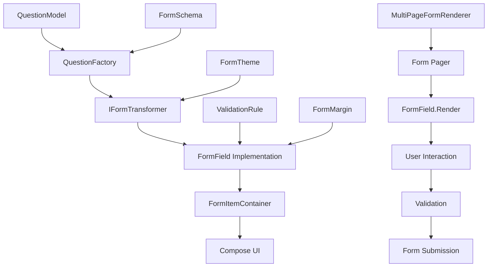
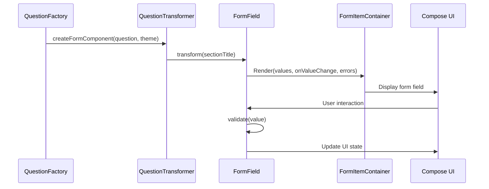

# Forms Library - Developer Guide

## Creating Custom Form Types

This guide provides a comprehensive understanding of how form types work in the Forms Library and how to create custom form types that integrate seamlessly with the existing architecture.

## Table of Contents

1. [Understanding the Architecture](#understanding-the-architecture)
2. [Core Interfaces and Classes](#core-interfaces-and-classes)
3. [Form Type Lifecycle](#form-type-lifecycle)
4. [Creating a Custom Form Type](#creating-a-custom-form-type)
5. [Integration with the Library](#integration-with-the-library)
6. [Advanced Patterns](#advanced-patterns)
7. [Best Practices](#best-practices)

## Understanding the Architecture

The Forms Library follows a well-structured architecture that separates concerns and provides extensibility. Here's how form types fit into the overall system:

### Architecture Overview



### Key Components

1. **Data Models**: `QuestionModel`, `FormSchema`, `FormTheme`
2. **Transformation Layer**: `IFormTransformer`, `QuestionFactory`
3. **Form Field Layer**: `FormField<T>`, `FormElement<T>`
4. **UI Layer**: `FormItemContainer`, Compose UI components
5. **Validation Layer**: `ValidationRule`, validation logic
6. **Integration Layer**: `MultiPageFormRenderer`, pagers

## Core Interfaces and Classes

### 1. FormElement Interface

The base interface that all form components must implement:

```kotlin
interface FormElement<T> {
    val id: String
    val margin: FormMargin

    @Composable
    fun Render(
        values: Map<String, Any>,
        onValueChange: (String, T) -> Unit,
        errors: Map<String, String?>
    )
}
```

**Key Points**:
- `T` represents the data type the component handles
- `id` uniquely identifies the component
- `margin` controls spacing around the component
- `Render` is the Compose function that draws the UI

### 2. FormField Interface

Extends `FormElement` with form-specific functionality:

```kotlin
interface FormField<T>: FormElement<T> {
    val pageId: String
    val label: String
    val placeholder: String?
    val required: Boolean
    val validators: List<ValidationRule>

    fun validate(value: T?): String?
}
```

**Key Points**:
- Adds form-specific properties like `label`, `required`, `validators`
- `validate` method handles validation logic
- `pageId` links the field to a specific form page

### 3. IFormTransformer Interface

Handles the transformation from data models to UI components:

```kotlin
interface IFormTransformer {
    val question: QuestionModel
    val type: FormType
    val theme: FormTheme?
    fun transform(sectionTitle: String? = null): FormField<Any>
}
```

**Key Points**:
- `question` contains the data model
- `type` identifies the form type
- `transform` creates the actual form field
- `theme` provides styling information

### 4. ValidationRule Type

Defines validation logic:

```kotlin
typealias ValidationRule = (String) -> String?

object ValidationRules {
    fun minLength(min: Int): ValidationRule = {
        if (it.length < min) "Minimum $min characters required" else null
    }
    
    fun maxLength(max: Int): ValidationRule = {
        if (it.length > max) "Maximum $max characters allowed" else null
    }
    
    fun numericOnly(): ValidationRule = {
        if (!it.matches(Regex("^[0-9]*$"))) "Only numbers are allowed" else null
    }
}
```

## Form Type Lifecycle

Understanding the lifecycle helps you create form types that integrate properly:



### Step-by-Step Lifecycle

1. **Creation**: `QuestionFactory` creates a transformer based on question type
2. **Transformation**: Transformer converts `QuestionModel` to `FormField`
3. **Rendering**: `MultiPageFormRenderer` calls `FormField.Render()`
4. **Interaction**: User interacts with the form field
5. **Validation**: Field validates input and updates error state
6. **Submission**: Form data is collected and submitted

## Creating a Custom Form Type

Let's create a custom `FormRatingInput` component as a complete example:

### Step 1: Define the Form Type Enum

First, add your new form type to the enum:

```kotlin
// In FormType.kt
enum class FormType {
    TEXT_INPUT,
    OPTION_INPUT,
    DROPDOWN,
    CHECKBOX,
    VIDEO_INPUT,
    IMAGE_INPUT,
    RATING_INPUT  // Add your new type
}
```

### Step 2: Create the Form Field Implementation

```kotlin
// FormRatingInput.kt
package com.wezacare.forms.app.components.formtypes

import androidx.compose.foundation.layout.*
import androidx.compose.material.icons.Icons
import androidx.compose.material.icons.filled.Star
import androidx.compose.material.icons.filled.StarBorder
import androidx.compose.material3.*
import androidx.compose.runtime.*
import androidx.compose.ui.Alignment
import androidx.compose.ui.Modifier
import androidx.compose.ui.graphics.Color
import androidx.compose.ui.text.SpanStyle
import androidx.compose.ui.text.buildAnnotatedString
import androidx.compose.ui.text.font.FontWeight
import androidx.compose.ui.text.withStyle
import androidx.compose.ui.unit.dp
import androidx.compose.ui.unit.sp
import com.wezacare.forms.app.model.ui.FormField
import com.wezacare.forms.app.model.ui.FormMargin
import com.wezacare.forms.app.model.ui.ValidationRule
import com.wezacare.forms.app.tranformer.FormType
import com.wezacare.forms.app.tranformer.IFormTransformer
import com.wezacare.forms.app.model.data.FormTheme
import com.wezacare.forms.app.model.data.QuestionModel
import com.wezacare.forms.core.presentation.DEFAULT_FORM_COLOR
import com.wezacare.forms.core.presentation.FormErrorRed
import com.wezacare.forms.core.presentation.SubtitleGray

data class FormRatingInput(
    override val id: String,
    override val pageId: String,
    override val label: String,
    val maxRating: Int = 5,
    val description: String? = null,
    val showPageTitle: Boolean = false,
    val color: Color = DEFAULT_FORM_COLOR,
    val pageTitle: String? = null,
    override val placeholder: String? = "",
    override val required: Boolean = false,
    override val validators: List<ValidationRule> = emptyList(),
    override val margin: FormMargin = FormMargin(4.dp, 4.dp)
): FormField<Int> {

    // Transformer implementation
    class Transformer(
        override val question: QuestionModel, 
        override val theme: FormTheme? = null
    ) : IFormTransformer {
        override val type: FormType
            get() = FormType.RATING_INPUT

        override fun transform(sectionTitle: String?): FormField<Any> {
            return FormRatingInput(
                id = question.id,
                pageId = question.pageId,
                label = question.label,
                placeholder = question.placeholder,
                description = question.description,
                required = question.required,
                pageTitle = sectionTitle,
                showPageTitle = !sectionTitle.isNullOrBlank(),
                color = theme?._primaryColor ?: DEFAULT_FORM_COLOR,
                maxRating = question.value?.toIntOrNull() ?: 5
            ) as FormField<Any>
        }
    }

    override fun validate(value: Int?): String? {
        if (required && (value == null || value == 0)) {
            return "Rating is required"
        }
        return validators.firstNotNullOfOrNull { validator ->
            value?.let { validator(it.toString()) }
        }
    }

    @Composable
    override fun Render(
        values: Map<String, Any>,
        onValueChange: (String, Int) -> Unit,
        errors: Map<String, String?>
    ) {
        val value = values[id] as? Int ?: 0
        val error = errors[id]

        Spacer(modifier = Modifier.size(margin.top))
        FormItemContainer(
            isValid = error.isNullOrBlank(),
            color = color,
            showPageTitle = showPageTitle,
            page = pageTitle
        ) {
            // Error display
            if (!error.isNullOrBlank()) {
                Text(
                    text = error,
                    color = FormErrorRed,
                    style = MaterialTheme.typography.labelSmall,
                    fontStyle = FontStyle.Italic
                )
            }
            
            // Label with required indicator
            Text(
                text = buildAnnotatedString {
                    append(label)
                    if (required) {
                        withStyle(style = SpanStyle(color = FormErrorRed)) {
                            append(" *")
                        }
                    }
                },
                fontWeight = FontWeight.Normal
            )
            
            Spacer(modifier = Modifier.size(4.dp))

            // Description
            if (!description.isNullOrBlank()) {
                Text(
                    modifier = Modifier.padding(vertical = 4.dp),
                    text = description,
                    fontSize = 13.sp,
                    color = SubtitleGray,
                    lineHeight = 16.sp
                )
                Spacer(modifier = Modifier.size(8.dp))
            }

            // Rating stars
            Row(
                modifier = Modifier.fillMaxWidth(),
                horizontalArrangement = Arrangement.Start,
                verticalAlignment = Alignment.CenterVertically
            ) {
                repeat(maxRating) { index ->
                    val starValue = index + 1
                    val isSelected = starValue <= value
                    
                    IconButton(
                        onClick = { onValueChange(id, starValue) },
                        modifier = Modifier.size(32.dp)
                    ) {
                        Icon(
                            imageVector = if (isSelected) Icons.Default.Star else Icons.Default.StarBorder,
                            contentDescription = "Rate $starValue",
                            tint = if (isSelected) color else Color.Gray,
                            modifier = Modifier.size(24.dp)
                        )
                    }
                }
                
                // Rating text
                if (value > 0) {
                    Spacer(modifier = Modifier.size(8.dp))
                    Text(
                        text = "$value/$maxRating",
                        style = MaterialTheme.typography.bodyMedium,
                        color = color
                    )
                }
            }
        }
        Spacer(modifier = Modifier.size(margin.bottom))
    }
}
```

### Step 3: Update QuestionFactory

Add your new form type to the factory:

```kotlin
// In QuestionFactory.kt
object QuestionFactory {
    fun createFormComponent(questionModel: QuestionModel, formTheme: FormTheme?): IFormTransformer? {
        return when(questionModel.type) {
            "short-text" -> FormTextInput.Transformer(questionModel, formTheme)
            "long-text" -> FormTextInput.Transformer(questionModel, formTheme)
            "dropdown" -> FormDropDown.Transformer(questionModel, formTheme)
            "checkbox" -> FormCheckBoxInput.Transformer(questionModel, formTheme)
            "multiple-choice" -> FormOptionInput.Transformer(questionModel, formTheme)
            "rating" -> FormRatingInput.Transformer(questionModel, formTheme)  // Add this line
            else -> return null
        }
    }
}
```

### Step 4: Usage Example

Now you can use your custom form type:

```kotlin
val questionModel = QuestionModel(
    id = "satisfaction-rating",
    pageId = "feedback-page",
    type = "rating",  // Your new type
    label = "How satisfied are you with our service?",
    required = true,
    description = "Please rate your experience from 1 to 5 stars",
    value = "5"  // Default max rating
)

// The form will automatically render your custom rating component
```

## Integration with the Library

### FormItemContainer Usage

All form fields should use `FormItemContainer` for consistent styling:

```kotlin
FormItemContainer(
    isValid = error.isNullOrBlank(),
    color = color,
    showPageTitle = showPageTitle,
    page = pageTitle
) {
    // Your form field content here
}
```

**Benefits**:
- Consistent styling across all form types
- Automatic error state handling
- Page title display support
- Theme color integration

### Validation Integration

Implement proper validation in your form field:

```kotlin
override fun validate(value: T?): String? {
    // Required field validation
    if (required && (value == null || isValueEmpty(value))) {
        return "Field is required"
    }
    
    // Custom validation rules
    return validators.firstNotNullOfOrNull { validator ->
        value?.let { validator(it.toString()) }
    }
}

private fun isValueEmpty(value: T): Boolean {
    return when (value) {
        is String -> value.isBlank()
        is Int -> value == 0
        is List<*> -> value.isEmpty()
        else -> false
    }
}
```

### Theme Integration

Use the theme colors consistently:

```kotlin
val primaryColor = theme?._primaryColor ?: DEFAULT_FORM_COLOR
val errorColor = FormErrorRed
val subtitleColor = SubtitleGray
```

## Advanced Patterns

### 1. Complex Data Types

For form fields that handle complex data types:

```kotlin
data class FormAddressInput(
    // ... other properties
): FormField<Address> {
    
    data class Address(
        val street: String,
        val city: String,
        val zipCode: String,
        val country: String
    )
    
    override fun validate(value: Address?): String? {
        if (required && value == null) {
            return "Address is required"
        }
        
        value?.let { address ->
            if (address.street.isBlank()) return "Street is required"
            if (address.city.isBlank()) return "City is required"
            if (address.zipCode.isBlank()) return "Zip code is required"
        }
        
        return null
    }
    
    @Composable
    override fun Render(
        values: Map<String, Any>,
        onValueChange: (String, Address) -> Unit,
        errors: Map<String, String?>
    ) {
        val currentAddress = values[id] as? Address ?: Address("", "", "", "")
        
        // Render multiple input fields for address components
        // Handle complex state management
    }
}
```

### 2. Conditional Rendering

Form fields that show/hide based on other field values:

```kotlin
data class FormConditionalInput(
    val dependsOn: String,
    val showWhen: (Any?) -> Boolean,
    // ... other properties
): FormField<String> {
    
    @Composable
    override fun Render(
        values: Map<String, Any>,
        onValueChange: (String, String) -> Unit,
        errors: Map<String, String?>
    ) {
        val dependentValue = values[dependsOn]
        
        if (showWhen(dependentValue)) {
            // Render the field
        } else {
            // Hide the field and clear its value
            if (values.containsKey(id)) {
                onValueChange(id, "")
            }
        }
    }
}
```

### 3. Custom Validation Rules

Create reusable validation rules:

```kotlin
object CustomValidationRules {
    fun email(): ValidationRule = { value ->
        val emailRegex = Regex("^[A-Za-z0-9+_.-]+@[A-Za-z0-9.-]+\\.[A-Za-z]{2,}$")
        if (!emailRegex.matches(value)) "Invalid email format" else null
    }
    
    fun phoneNumber(): ValidationRule = { value ->
        val phoneRegex = Regex("^\\+?[1-9]\\d{1,14}$")
        if (!phoneRegex.matches(value.replace("\\s".toRegex(), ""))) {
            "Invalid phone number format"
        } else null
    }
    
    fun customRange(min: Int, max: Int): ValidationRule = { value ->
        val numValue = value.toIntOrNull()
        when {
            numValue == null -> "Must be a number"
            numValue < min -> "Value must be at least $min"
            numValue > max -> "Value must be at most $max"
            else -> null
        }
    }
}

// Usage
val formField = FormTextInput(
    // ... other properties
    validators = listOf(
        CustomValidationRules.email(),
        ValidationRules.minLength(5)
    )
)
```

## Best Practices

### 1. Consistent Styling

- Always use `FormItemContainer` for consistent appearance
- Follow the established color scheme
- Use proper spacing with `FormMargin`
- Implement error states consistently

### 2. Accessibility

```kotlin
// Add proper content descriptions
Icon(
    imageVector = icon,
    contentDescription = "Action description",  // Always provide this
    modifier = Modifier.size(24.dp)
)

// Use semantic modifiers
Modifier.semantics {
    contentDescription = "Form field description"
    role = Role.Button  // or appropriate role
}
```

### 3. Performance

- Use `remember` for expensive computations
- Implement proper state management
- Avoid unnecessary recompositions
- Use `LazyColumn` for large lists of options

### 4. Error Handling

```kotlin
// Always handle null values gracefully
val value = values[id] as? String ?: ""

// Provide meaningful error messages
override fun validate(value: String?): String? {
    return when {
        required && value.isNullOrBlank() -> "This field is required"
        value != null && !isValidFormat(value) -> "Invalid format"
        else -> null
    }
}
```

### 5. Testing

Create testable form fields:

```kotlin
// Make validation logic testable
class FormRatingInputValidator {
    fun validate(value: Int?, required: Boolean): String? {
        if (required && (value == null || value == 0)) {
            return "Rating is required"
        }
        return null
    }
}

// Use in your form field
override fun validate(value: Int?): String? {
    return FormRatingInputValidator().validate(value, required)
}
```

### 6. Documentation

Document your custom form types:

```kotlin
/**
 * A form field for rating input with star-based selection.
 * 
 * @param maxRating Maximum number of stars (default: 5)
 * @param description Optional description text below the label
 * 
 * Usage:
 * ```kotlin
 * QuestionModel(
 *     type = "rating",
 *     label = "Rate our service",
 *     value = "5"  // Max rating
 * )
 * ```
 */
data class FormRatingInput(
    // ... implementation
)
```

This developer guide provides everything you need to understand and create custom form types that integrate seamlessly with the Forms Library. The architecture is designed to be extensible while maintaining consistency and reliability across all form components.
