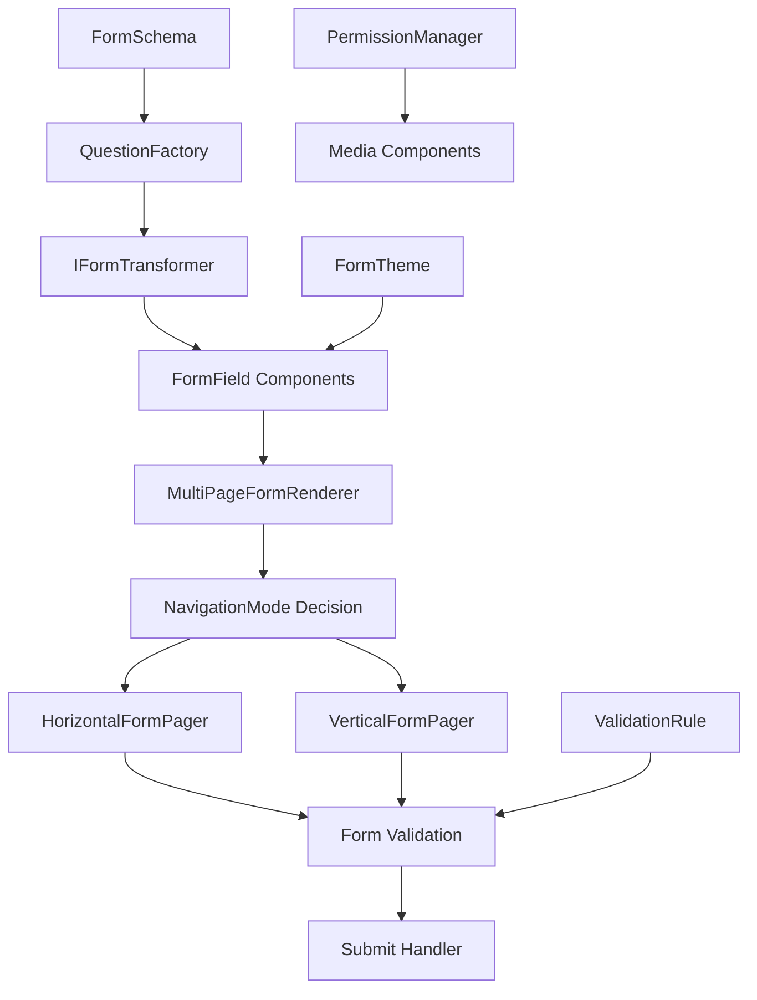
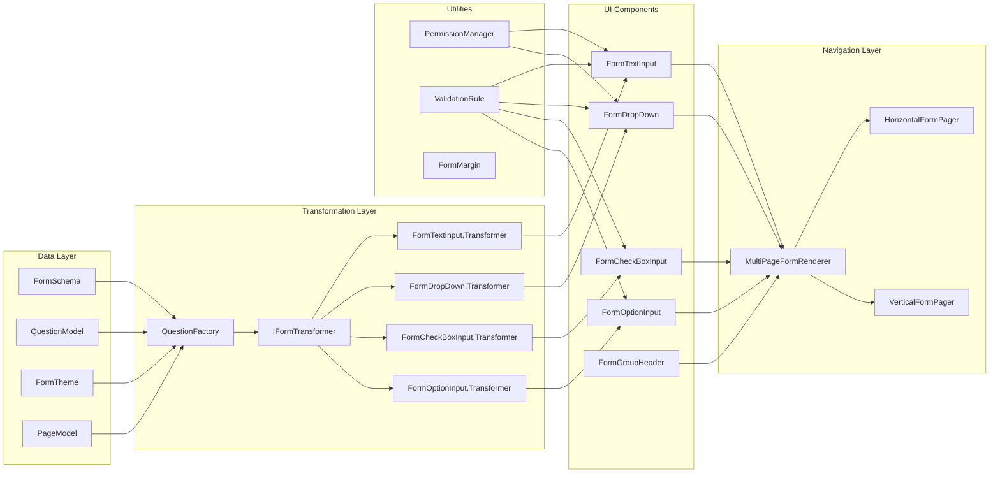

# Forms Library Documentation

A comprehensive Kotlin Multiplatform forms library built with Jetpack Compose that provides dynamic form rendering, multi-page navigation, and extensive customization options.

## Table of Contents

1. [Overview](#overview)
2. [Architecture](#architecture)
3. [Form Types](#form-types)
4. [Pagers and Navigation](#pagers-and-navigation)
5. [Utilities and Supporting Components](#utilities-and-supporting-components)
6. [Complete Usage Example](#complete-usage-example)
7. [Getting Started](#getting-started)

## Overview

The Forms Library is designed to handle complex, multi-page forms with dynamic rendering based on JSON schemas. It supports various input types, validation, theming, and flexible navigation patterns. The library is built with Kotlin Multiplatform, making it suitable for both Android and iOS applications.

### Key Features

- **Dynamic Form Rendering**: Forms are rendered from JSON schemas
- **Multi-page Support**: Both horizontal and vertical navigation modes
- **Multiple Input Types**: Text, dropdown, checkbox, radio buttons, and more
- **Validation System**: Built-in validation with custom rules
- **Theming Support**: Customizable colors and styling
- **Permission Management**: Cross-platform permission handling
- **Type Safety**: Strong typing with Kotlin data classes

## Architecture

The library follows a modular architecture with clear separation of concerns:

### Core Components

1. **Data Models**: Define the structure of forms, questions, and themes
2. **Form Components**: Individual input components (text, dropdown, etc.)
3. **Transformers**: Convert data models to UI components
4. **Pagers**: Handle navigation between form pages
5. **Utilities**: Supporting functionality like permissions and validation

### Data Flow



### Component Architecture



## Form Types

The library supports six main form input types, each with specific use cases and configurations:

### 1. TEXT_INPUT

**Usage**: Single-line and multi-line text input fields
**Types**: `short-text`, `long-text`

```kotlin
QuestionModel(
    id = "name-field",
    pageId = "page-1",
    type = "short-text",
    label = "Full Name",
    required = true,
    placeholder = "Enter your full name",
    description = "This will be used for official documents"
)
```

**Features**:
- Placeholder text support
- Required field validation
- Description text
- Custom styling with theme colors

### 2. OPTION_INPUT (Radio Buttons)

**Usage**: Single selection from multiple options
**Type**: `multiple-choice`

```kotlin
QuestionModel(
    id = "employment-type",
    pageId = "page-1",
    type = "multiple-choice",
    label = "Employment Type",
    required = true,
    options = listOf(
        QuestionOption("Full-Time", "fulltime"),
        QuestionOption("Part-Time", "parttime"),
        QuestionOption("Contract", "contract")
    )
)
```

**Features**:
- Radio button selection
- Single choice validation
- Custom option styling

### 3. DROPDOWN

**Usage**: Dropdown selection from multiple options
**Type**: `dropdown`

```kotlin
QuestionModel(
    id = "department",
    pageId = "page-1",
    type = "dropdown",
    label = "Department",
    required = true,
    options = listOf(
        QuestionOption("Engineering", "eng"),
        QuestionOption("Marketing", "mkt"),
        QuestionOption("Sales", "sales")
    )
)
```

**Features**:
- Dropdown menu interface
- Search functionality
- Custom styling

### 4. CHECKBOX

**Usage**: Multiple selection from options
**Type**: `checkbox`

```kotlin
QuestionModel(
    id = "skills",
    pageId = "page-1",
    type = "checkbox",
    label = "Technical Skills",
    required = false,
    options = listOf(
        QuestionOption("Kotlin", "kotlin"),
        QuestionOption("Java", "java"),
        QuestionOption("Python", "python"),
        QuestionOption("JavaScript", "js")
    )
)
```

**Features**:
- Multiple selection support
- Checkbox validation
- Custom tint colors

### 5. VIDEO_INPUT

**Usage**: Video capture and selection
**Type**: `video-input`

**Features**:
- Camera integration
- Gallery selection
- Permission handling
- Video preview

### 6. IMAGE_INPUT

**Usage**: Image capture and selection
**Type**: `image-input`

**Features**:
- Camera integration
- Gallery selection
- Permission handling
- Image preview

## Pagers and Navigation

The library provides two navigation modes for multi-page forms:

### Navigation Modes

#### 1. HORIZONTAL Navigation

**Usage**: Step-by-step form progression with page-by-page navigation
**Best for**: Linear workflows, guided processes

```kotlin
val multiPageForm = MultiPageForm(
    pages = formPages,
    formTitle = "Employee Onboarding",
    formDescription = "Complete your onboarding process",
    navigationMode = NavigationMode.HORIZONTAL,
    formTheme = customTheme
)
```

**Features**:
- Page-by-page progression
- Back/Next navigation
- Page validation before proceeding
- Progress indicators
- Page-specific validation

#### 2. VERTICAL Navigation

**Usage**: Single-page scrollable form with all fields visible
**Best for**: Shorter forms, quick data entry

```kotlin
val multiPageForm = MultiPageForm(
    pages = formPages,
    formTitle = "Quick Survey",
    formDescription = "Tell us about yourself",
    navigationMode = NavigationMode.VERTICAL,
    formTheme = customTheme
)
```

**Features**:
- All fields visible at once
- Continuous scrolling
- Global form validation
- Single submit action

### View Modes

#### EDIT Mode
- Full interaction capabilities
- Validation enabled
- Submit functionality

#### READONLY Mode
- Display-only mode
- No user input
- Used for form previews or completed forms

## Utilities and Supporting Components

### Permission Manager

Cross-platform permission handling for camera and gallery access:

```kotlin
val permissionManager = createPermissionManager { permissionType, status ->
    when (status) {
        PermissionStatus.GRANTED -> {
            // Permission granted, proceed with action
        }
        PermissionStatus.DENIED -> {
            // Show rationale or redirect to settings
        }
        PermissionStatus.SHOW_RATIONAL -> {
            // Show explanation dialog
        }
    }
}

// Check permission status
val hasCameraPermission = permissionManager.isPermissionGranted(PermissionType.CAMERA)

// Request permission
permissionManager.askPermission(PermissionType.CAMERA)
```

**Supported Permissions**:
- `CAMERA`: For image/video capture
- `GALLERY`: For media selection

### Form Transformers

The `IFormTransformer` interface and `QuestionFactory` handle the conversion from data models to UI components:

```kotlin
// Automatic transformation
val transformer = QuestionFactory.createFormComponent(questionModel, formTheme)
val formField = transformer?.transform()

// Custom transformer implementation
class CustomFormTransformer(
    override val question: QuestionModel,
    override val theme: FormTheme?
) : IFormTransformer {
    override val type: FormType = FormType.CUSTOM
    
    override fun transform(sectionTitle: String?): FormField<Any> {
        // Custom transformation logic
    }
}
```

### Validation System

Built-in validation with support for custom rules:

```kotlin
data class FormTextInput(
    // ... other properties
    override val validators: List<ValidationRule> = emptyList()
) : FormField<String> {
    
    override fun validate(value: String?): String? {
        if (required && value.isNullOrBlank()) {
            return "Field is required"
        }
        return validators.firstNotNullOfOrNull { validator ->
            validator(value)
        }
    }
}

// Custom validation example
val emailValidator = ValidationRule { value ->
    if (!value.contains("@")) "Invalid email format" else null
}
```

### Theme System

Comprehensive theming support with color customization:

```kotlin
val customTheme = FormTheme(
    primaryColor = "#1a73e8",
    headerImage = FormTheme.HeaderImage(
        url = "https://example.com/header-image.jpg"
    )
)

// Usage in form schema
val formSchema = FormSchema(
    // ... other properties
    theme = customTheme
)
```

## Complete Usage Example

Here's a complete example showing how to create and render a multi-page form:

```kotlin
@Composable
fun EmployeeOnboardingForm() {
    val formData = FormSchema(
        id = "employee-onboarding",
        title = "Employee Onboarding",
        description = "Complete your onboarding process",
        redirectUrl = "/onboarding/complete",
        thumbnail = "https://example.com/thumbnail.jpg",
        isVerticalScroll = false, // Use horizontal navigation
        isPublished = true,
        isPublic = false,
        organisationId = "company-123",
        createdBy = "HR Team",
        createdAt = "2024-01-01T00:00:00Z",
        updatedAt = "2024-01-01T00:00:00Z",
        theme = FormTheme(
            primaryColor = "#1a73e8",
            headerImage = FormTheme.HeaderImage(
                url = "https://example.com/header.jpg"
            )
        ),
        pages = listOf(
            PageModel(
                id = "personal-info",
                title = "Personal Information",
                order = 0,
                formId = "employee-onboarding"
            ),
            PageModel(
                id = "job-details",
                title = "Job Details",
                order = 1,
                formId = "employee-onboarding"
            )
        ),
        questions = listOf(
            // Personal Information Page
            QuestionModel(
                id = "first-name",
                pageId = "personal-info",
                type = "short-text",
                label = "First Name",
                required = true,
                placeholder = "Enter your first name"
            ),
            QuestionModel(
                id = "last-name",
                pageId = "personal-info",
                type = "short-text",
                label = "Last Name",
                required = true,
                placeholder = "Enter your last name"
            ),
            QuestionModel(
                id = "email",
                pageId = "personal-info",
                type = "short-text",
                label = "Email Address",
                required = true,
                placeholder = "your.email@company.com"
            ),
            
            // Job Details Page
            QuestionModel(
                id = "department",
                pageId = "job-details",
                type = "dropdown",
                label = "Department",
                required = true,
                options = listOf(
                    QuestionOption("Engineering", "eng"),
                    QuestionOption("Marketing", "mkt"),
                    QuestionOption("Sales", "sales"),
                    QuestionOption("HR", "hr")
                )
            ),
            QuestionModel(
                id = "employment-type",
                pageId = "job-details",
                type = "multiple-choice",
                label = "Employment Type",
                required = true,
                options = listOf(
                    QuestionOption("Full-Time", "fulltime"),
                    QuestionOption("Part-Time", "parttime"),
                    QuestionOption("Contract", "contract")
                )
            ),
            QuestionModel(
                id = "skills",
                pageId = "job-details",
                type = "checkbox",
                label = "Technical Skills",
                required = false,
                options = listOf(
                    QuestionOption("Kotlin", "kotlin"),
                    QuestionOption("Java", "java"),
                    QuestionOption("Python", "python"),
                    QuestionOption("JavaScript", "js")
                )
            )
        )
    )

    MultiPageFormRenderer(
        formData = formData,
        viewMode = ViewMode.EDIT,
        onSubmit = { formValues ->
            // Handle form submission
            println("Form submitted with values: $formValues")
            // Process the form data
            processOnboardingData(formValues)
        },
        onBackClick = {
            // Handle back navigation
            navigateBack()
        }
    ) {
        // Custom footer content
        Text(
            text = "© 2024 Company Name. All rights reserved.",
            style = MaterialTheme.typography.bodySmall,
            modifier = Modifier.padding(16.dp)
        )
    }
}

private fun processOnboardingData(values: Map<String, Any>) {
    // Extract and process form values
    val firstName = values["first-name"] as? String
    val lastName = values["last-name"] as? String
    val email = values["email"] as? String
    val department = values["department"] as? String
    val employmentType = values["employment-type"] as? String
    val skills = values["skills"] as? String
    
    // Process the data (save to database, send to API, etc.)
    // ...
}
```

## Getting Started

### 1. Add Dependencies

Add the library to your project's `build.gradle.kts`:

```kotlin
dependencies {
    implementation("com.wezacare:forms-library:1.0.0")
}
```

### 2. Create Form Schema

Define your form structure using `FormSchema` and `QuestionModel`:

```kotlin
val formSchema = FormSchema(
    id = "my-form",
    title = "My Form",
    description = "Form description",
    // ... other properties
    questions = listOf(
        QuestionModel(
            id = "field-1",
            pageId = "page-1",
            type = "short-text",
            label = "Field Label",
            required = true
        )
    )
)
```

### 3. Render the Form

Use `MultiPageFormRenderer` to display your form:

```kotlin
@Composable
fun MyFormScreen() {
    MultiPageFormRenderer(
        formData = formSchema,
        viewMode = ViewMode.EDIT,
        onSubmit = { values -> /* handle submission */ },
        onBackClick = { /* handle back */ }
    ) {
        // Custom footer
    }
}
```

### 4. Handle Permissions (for media inputs)

If using camera or gallery inputs, set up permission handling:

```kotlin
val permissionManager = createPermissionManager { type, status ->
    // Handle permission results
}

// Request permissions when needed
permissionManager.askPermission(PermissionType.CAMERA)
```

This comprehensive documentation should help you understand and effectively use the Forms Library. The modular architecture makes it easy to extend and customize according to your specific needs.
